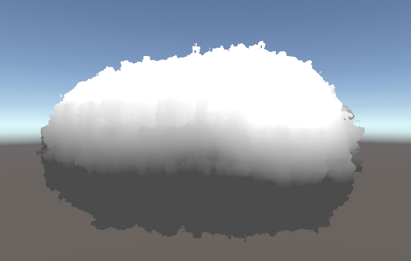

# Volumetric Clouds for the Unity Game Engine
After spending a semester learning and playing with shaders under THREE.js we decided to use what we learned to develop a practical shader that could be used in an existing engine.
So we decided to implement volumetric clouds in a compute shader using HLSL. A lot of this work extends upon [Sebastian Lague's Raymarching Coding Adventure Video](https://www.youtube.com/watch?v=Cp5WWtMoeKg)
While the shader can be improved through the implementation of a light scattering function, with our time limit we managed to get this:

